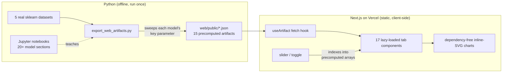

# Dive Deeper into Linear Models

> An interactive playground + notebook series exploring 20+ regression and classification models on real datasets — deployed live on Vercel.


**🔗 Live demo: [dive-deep-linear-models.vercel.app](https://dive-deep-linear-models.vercel.app)**

---

## Recruiter TL;DR

- **What it is:** two teaching notebooks covering 20+ supervised-learning models (regularized, kernel, robust, generalized, and probabilistic linear models plus tree ensembles), paired with a **17-tab interactive web app** — including a live model-serving API — that lets anyone explore each model by dragging sliders and watching charts redraw. Deployed on Vercel with CI.
- **Hardest problem solved well:** making trained scikit-learn models *interactive in the browser with no backend and no ML runtime client-side* — models are fit once in Python, swept over their key parameter, and exported as compact precomputed JSON that a dependency-free React/SVG layer redraws instantly.
- **Why it matters:** closes the most common student-portfolio gap — a model that "works in a notebook but was never deployed." Here the models are deployed, and made legible to a non-expert.

---

## Overview

Linear and kernel-based models are the backbone of applied machine learning, but most learning resources stop at a static plot. This project turns the "dive deeper" material into something you can *poke at*: move a regularization penalty and watch Lasso zero out features in real time; inject outliers and watch ordinary least squares swing while robust regressors hold; drag a decision threshold and watch precision trade against recall on a live ROC curve.

It was built as both a teaching resource and a portfolio piece — the notebooks are the reference, and the web app is the proof that the models were deployed and communicated, not just trained.

**Scope note (no redundancy):** plain linear and logistic regression *fundamentals* (pipelines, leakage-free preprocessing, honest evaluation) live in the companion repo **[Basics of Linear & Logistic Regression](https://github.com/shiva-shivanibokka/Basics-of-Linear-and-Logistic-Regression)**. This repo deliberately goes deeper into the regularized, kernel, robust, generalized, and probabilistic members of the family.

---

## The Interactive Playground

Seventeen demo tabs — sixteen render precomputed artifacts as inline SVG, and one calls a live prediction API:

| # | Tab | What you do | Models | Dataset |
|---|-----|-------------|--------|---------|
| 1 | Linear Regression | pick a feature → best-fit line, R², RMSE | OLS | California Housing |
| 2 | Bias–Variance | drag polynomial degree 1→15 → watch over/underfitting | Polynomial | Diabetes |
| 3 | Regularization | slide α → coefficient paths shrink, Lasso zeroes out | Ridge, Lasso, ElasticNet | Diabetes |
| 4 | KNN & SVR | change k / ε-tube → fit reshapes | KNN, SVR | California Housing |
| 5 | Bayesian Regression | raise prior strength → uncertainty band widens | Bayesian linear | Diabetes |
| 6 | Robust Regression | inject outliers → OLS swings, robust fits hold | Huber, RANSAC, Theil-Sen | Diabetes |
| 7 | Generalized Linear Models | toggle GLM → OLS predicts negatives, GLMs don't | Poisson, Gamma, Tweedie | California Housing |
| 8 | Quantile Regression | slide quantile 0.1→0.9 → build a prediction interval | Quantile | Diabetes |
| 9 | Discriminant Analysis | toggle LDA/QDA → linear vs curved boundary + ellipses | LDA, QDA | Wine |
| 10 | Naive Bayes | see class-conditional decision regions | Gaussian NB | Iris |
| 11 | KNN & SVM | change k / kernel → boundary reshapes | KNN, SVM | Iris |
| 12 | Linear Classifiers | step Perceptron iterations → boundary settles | Perceptron, Ridge Classifier | Iris |
| 13 | Boosting & Importance | compare importances + partial dependence | Gradient Boosting, XGBoost | Breast Cancer |
| 14 | Threshold, ROC & Metrics | drag threshold → confusion matrix + ROC/PR move live | Gradient Boosting | Breast Cancer |
| 15 | Model Comparison | sortable leaderboard across every model | all | Diabetes + Breast Cancer |
| 16 | **Live API** | edit features → **real serverless prediction** via `/api/predict` | Ridge (served) | California Housing |
| 17 | About | plain-language guide to every model | — | — |

Each demo tab also links back to the exact notebook that teaches it. Every chart carries a heading, a
plain-language "how to read it" caption, and a `?` tooltip on each legend entry (and each Live-API input)
that defines the term — so a visitor who has never heard of "RANSAC" or "MedInc" can still follow along.

### Live prediction API

Beyond the precomputed demos, the app exposes a genuine **model-serving endpoint** — a Ridge
regressor trained offline in Python, exported as coefficients, and served by a Vercel serverless
function that standardizes inputs and computes the prediction live (no Python at runtime):

```bash
curl -X POST https://dive-deep-linear-models.vercel.app/api/predict \
  -H "Content-Type: application/json" \
  -d '{"features":{"MedInc":8.3,"HouseAge":41,"AveRooms":6.9,"AveBedrms":1.02,"Population":322,"AveOccup":2.5,"Latitude":37.88,"Longitude":-122.23}}'
# -> {"prediction":4.127,"unit":"median house value (in $100,000s)","usd":412733}
```

A `GET` to the same URL returns the model's feature schema and an example payload.

---

## Architecture

The core decision: **precompute in Python, interpolate in the browser.** No model runs client-side and there is no backend — every demo reads a small JSON artifact that was computed once by sweeping a model's key parameter offline. This keeps the site fully static (instant, free to host, nothing to secure) while still feeling live.



**Why this shape:**
- *Precomputed artifacts over live inference* — porting sklearn models (SVR, Bayesian ridge, XGBoost) to JS/WASM would be far more work and fragile; precomputing gives the same interactivity for a fraction of the effort and ships zero ML runtime to the client.
- *Inline SVG over a chart library* — the whole frontend depends only on `next`, `react`, and `react-dom`. Every chart (scatter, coefficient paths, decision-boundary heat maps, ROC curves, covariance ellipses) is drawn by a small shared SVG helper module.
- *Committed artifacts* — the JSON is committed, so the Vercel build needs no Python; it just builds the Next app.

---

## Tech Stack

| Layer | Choice | Version | Why |
|-------|--------|---------|-----|
| Models & data | scikit-learn, XGBoost, NumPy | sklearn 1.8, xgb 3.2 | every model here is standard sklearn/xgboost; datasets ship with sklearn (no downloads) |
| Export | Python | 3.12 | one script, one builder per artifact, with an assert-based self-check |
| Frontend | Next.js 15 · React 19 · TypeScript | Next 15, React 19 | App Router + lazy tab loading; strict TS |
| Charts | inline SVG | — | zero chart-library dependencies |
| Hosting | Vercel | — | static client-side app, auto-detected Next.js |

---

## Skills Demonstrated

- **Applied ML breadth** — regularization, robust regression, generalized linear models, discriminant analysis, kernel methods, and boosting, applied and compared on real datasets.
- **Production ML serving / MLOps** — a trained model deployed behind a live serverless prediction API, separate from the training/notebook code.
- **Cloud deployment (Vercel)** — a working, publicly reachable production URL, not a local-only demo.
- **CI/CD** — GitHub Actions runs the test suite, the export self-check, and the web build on every push.
- **Automated testing** — a pytest suite validating the schema/shape contract of every precomputed artifact.
- **System design & architecture** — a documented, deliberate tradeoff (precomputed artifacts vs. client-side inference) recorded in `docs/superpowers/specs/`.
- **Data-to-artifact pipeline** — a reproducible export stage that transforms raw sklearn datasets into model-ready, versioned JSON with a validation self-check.
- **Frontend engineering** — TypeScript + React/Next.js, dependency-light, accessible controls, responsive SVG.
- **Technical communication** — turning ML concepts into interactive explanations a non-expert can follow.

---

## Project Structure

```
Dive-deeper-into-linear-models/
├── linear_regression_models.ipynb     # 11 regression model sections (incl. Robust, GLM, Quantile)
├── classification_models.ipynb        # 7 classification model sections
├── requirements.txt                   # Python deps for the notebooks + export
├── scripts/
│   └── export_web_artifacts.py        # sklearn models → web/public/*.json (with self-check)
├── tests/
│   └── test_export_artifacts.py       # pytest: artifact schema/shape contract
├── .github/workflows/ci.yml           # CI: pytest + export self-check + web build
├── web/                               # Next.js 15 interactive playground
│   ├── app/
│   │   ├── page.tsx                   # tab shell (hero, tab bar, panel)
│   │   ├── models.ts                  # tab registry — single source of truth
│   │   ├── api/predict/               # serverless model-serving endpoint + exported model
│   │   ├── lib/                       # useArtifact hook + shared SVG chart helpers
│   │   └── components/                # 17 tab components (one per demo)
│   └── public/                        # 15 precomputed JSON artifacts
└── docs/superpowers/                  # design spec + implementation plan
```

---

## Getting Started

### Run the notebooks

```bash
git clone https://github.com/shiva-shivanibokka/Dive-deeper-into-linear-models.git
cd Dive-deeper-into-linear-models
pip install -r requirements.txt
jupyter notebook          # open either .ipynb and run top-to-bottom
```

The notebooks also run in [Google Colab](https://colab.research.google.com/) with no local setup.

### Run the web app locally

```bash
cd web
npm install
npm run dev               # http://localhost:3000
```

### Regenerate the precomputed artifacts

Only needed if you change the data or models:

```bash
python scripts/export_web_artifacts.py   # writes web/public/*.json, then self-checks
```

---

## Deployment

Deployed on **Vercel** (project root: `web/`). The demo tabs are static client-side pages served from committed artifacts (no env vars, no Python at build time), plus one **serverless function** (`/api/predict`) for the live prediction endpoint. Live at **[dive-deep-linear-models.vercel.app](https://dive-deep-linear-models.vercel.app)**.

> Note: the Vercel project's **Root Directory** must be set to `web` for git-triggered redeploys, since the Next.js app lives in a subdirectory.

---

## Testing & CI

Every push runs **GitHub Actions** (`.github/workflows/ci.yml`) with two jobs:

- **Artifacts & tests** — a `pytest` suite (`tests/test_export_artifacts.py`) that fits each model and asserts its exported artifact matches the schema/shape the frontend consumes (matrix dimensions, boundary-grid squareness, metric bounds, the serving-model contract), then runs the export script's own assert-based self-check.
- **Build web app** — `npm ci` + `next build` with **strict TypeScript**, so a type error or broken tab fails CI.

Run locally:

```bash
pytest -q                       # 13 artifact-contract tests
cd web && npm run build         # type-check + build
```

The notebooks additionally execute top-to-bottom without errors (verified via `jupyter nbconvert --execute`).

---

## Roadmap / Known Limitations

- Demos show a small, representative parameter sweep per model (e.g. a handful of α values), not a continuous fit — a deliberate size/latency tradeoff of the precomputed approach.
- Bias–Variance, Bayesian, Robust, and Quantile demos use a single real feature to keep the curve visualizable in 2D.
- Possible next steps: a continuous-parameter mode via lightweight client-side interpolation, and per-tab links back to the exact notebook cell.

---

## License

MIT — see [LICENSE](./LICENSE).

---

## Author

**Shivani Bokka** — built as a teaching resource and portfolio piece demonstrating applied supervised learning, front-end engineering, and cloud deployment end to end.
